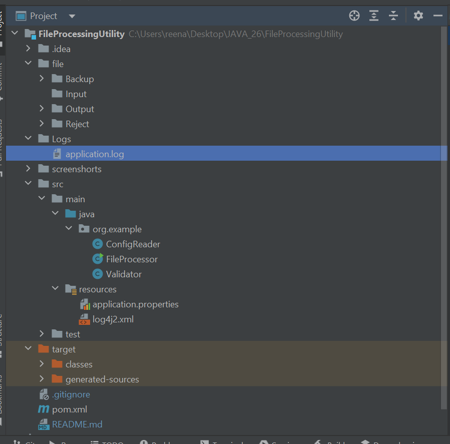
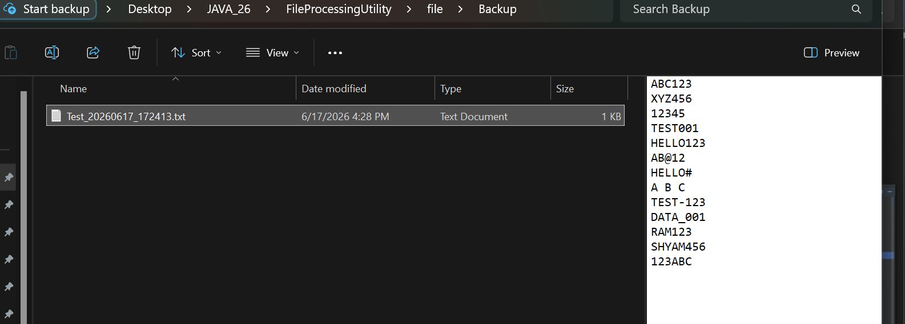
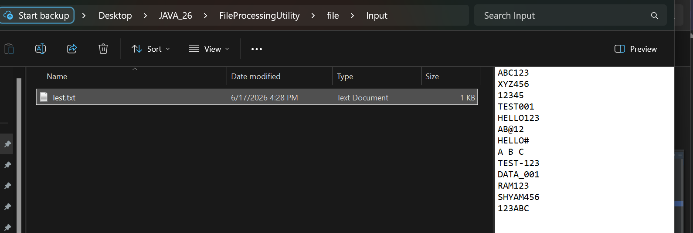
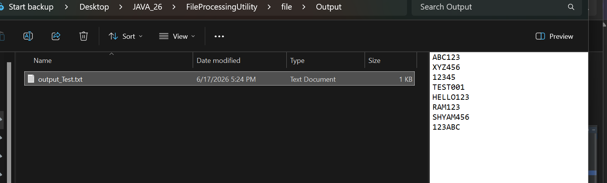
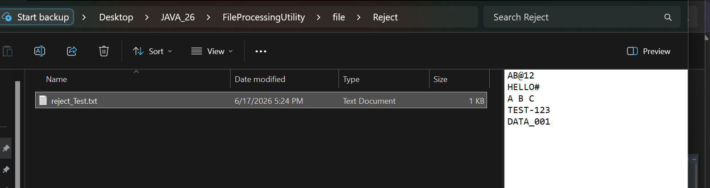
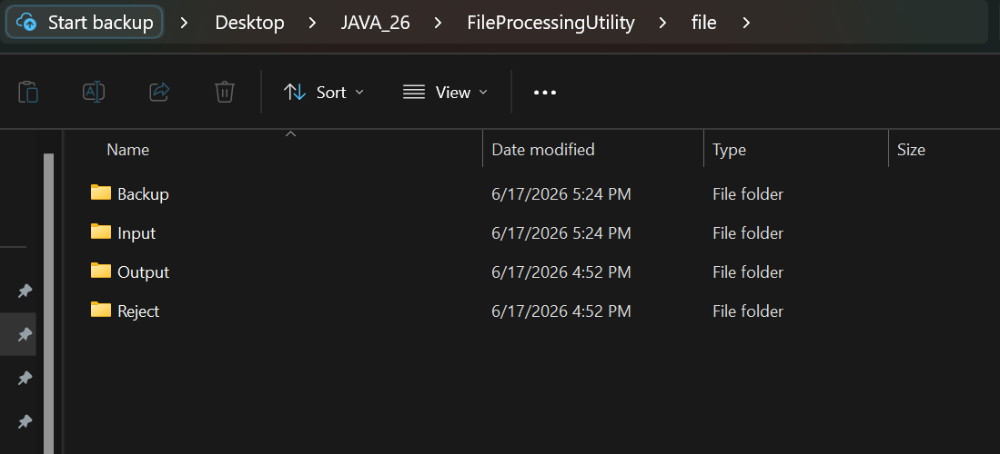

# Java File Processing Utility

## Overview

This project is a Java-based File Processing Utility developed using Core Java and Maven.

The application reads text files from the Input folder, validates each record, separates valid and invalid records, generates logs, and moves processed files to a Backup folder.

---

## Application Workflow

```text
                    +----------------+
                    | Input Folder   |
                    +----------------+
                            |
                            v
                 +--------------------+
                 |  Read Text File    |
                 +--------------------+
                            |
                            v
                 +--------------------+
                 | Validate Records   |
                 +--------------------+
                            |
                +-----------+-----------+
                |                       |
                v                       v
      +----------------+      +----------------+
      | Valid Records  |      | Invalid Records|
      +----------------+      +----------------+
                |                       |
                v                       v
      +----------------+      +----------------+
      | Output Folder  |      | Reject Folder  |
      +----------------+      +----------------+

                            |
                            v

                 +--------------------+
                 | Processing Summary |
                 +--------------------+
                            |
                            v
                 +--------------------+
                 | Log Generation     |
                 +--------------------+
                            |
                            v
                 +--------------------+
                 | Backup Input File  |
                 +--------------------+
                            |
                            v
                 +--------------------+
                 | Backup Folder      |
                 +--------------------+
```

---

## Features

- Read input files from Input folder
- Record validation
- Separate valid and invalid records
- Store valid records in Output folder
- Store invalid records in Reject folder
- Move processed file to Backup folder
- External configuration using application.properties
- Logging using Log4j2
- Maven based project structure
- Exception handling

---

## Technologies Used

- Java 8
- Maven
- Log4j2
- File I/O
- Properties File

---

## Folder Structure

```text
FileProcessingUtility
│
├── file
│   ├── Input
│   ├── Output
│   ├── Reject
│   └── Backup
│
├── Logs
│
├── src
│   └── main
│       ├── java
│       │   └── org.example
│       │       ├── FileProcessor.java
│       │       ├── Validator.java
│       │       └── ConfigReader.java
│       │
│       └── resources
│           ├── application.properties
│           └── log4j2.xml
│
│
├── README.md
└── pom.xml

```

---
## Project Screenshots

### Project Structure



### Backup Folder



### Input Folder



### Output Folder




### Reject Folder




### file




----
## Sample Input

```text
12345
98765
ABC12
123
HELLO
```

---

## Sample Output

```text
12345
98765
```

---

## Sample Reject Records

```text
ABC12
123
HELLO
```

---

## Logging

The application generates logs using Log4j2.

Example:

```text
File=Test.txt Total=13 Valid=8 Invalid=5
File moved to backup : Test_20260617_172413.txt
```

---

## Future Enhancements

- Scheduler support
- FTP/SFTP integration
- CSV file processing
- Excel file processing
- Spring Boot REST API
- Email notification support
- Database integration
- Encryption and Decryption support

---

## Author

Sneha Yadav